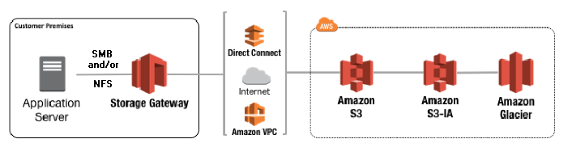

**Storage**

Topics:

* Amazon S3
* Amazon Elastic Block Store
* Amazon Elastic File System
* Amazon FSx for Lustre
* Amazon FSx for Windows File Server
* Amazon S3 Glacier
* AWS Storage Gateway

***

**S3:**

**Amazon Simple Storage Service (Amazon S3)** is an object storage service that offers industry-leading scalability, data availability, security, and performance.

S3 storage classes:

**Standard:**

* Low latency and high throughput performance
* durability of 99.999999999% of objects across multiple Availability Zones
* 99.99% availability over a given year
* Supports SSL for data in transit and encryption of data at rest
* automatic migration of objects to other S3 Storage Classes 

**S3 Intelligent-Tiering:**

his storage class incorporates two access tiers: frequent access and infrequent access. .S3 Intelligent-Tiering monitors access patterns and moves objects that have not been accessed for 30 consecutive days to the infrequent access tier. If the data is accessed later, it is automatically moved back to the frequent access tier.

 *The bottom line: You save money even under changing access patterns, with no performance impact, no operational overhead, and no retrieval fees.*
 
 * durability of 99.999999999% of objects across multiple Availability Zones
 * 99.9% availability over a given year
 * Same low latency and high throughput performance of S3 Standard
 * Automatically moves objects between two access tiers based on changing access patterns
 * Small monthly monitoring and auto-tiering fee
 * Supports SSL for data in transit and encryption of data at rest
 * Backed with the Amazon S3 Service Level Agreement for availability
 
 

**S3 Standard-Infrequent Access (S3 Standard-IA):**
 
 S3 Standard-IA is for data that is accessed less frequently, but requires rapid access when needed.
 This combination of low cost and high performance make S3 Standard-IA ideal for long-term storage, backups, and as a data store for disaster recovery files.
 
 * durability of 99.999999999% of objects across multiple Availability Zones
 * 99.9% availability over a given year
 * Data is resilient in the event of one entire Availability Zone destruction
 * Same low latency and high throughput performance of S3 Standard
 * etc

**S3 One Zone-Infrequent Access (S3 One Zone-IA):**
 
Unlike other S3 Storage Classes which store data in a minimum of three Availability Zones (AZs), S3 One Zone-IA stores data in a single AZ and costs 20% less than S3 Standard-IA. 

* Same low latency and high throughput performance of S3 Standard
* 99.5% availability over a given year
* durability of 99.999999999% of objects in a single Availability Zone

**S3 Glacier:**

S3 Glacier is a secure, durable, and low-cost storage class for data archiving. 
S3 Glacier provides three retrieval options that range from a few minutes to hours.

* durability of 99.999999999% of objects across multiple Availability Zones
* Data is resilient in the event of one entire Availability Zone destruction
* S3 PUT API for direct uploads to S3 Glacier, and S3 Lifecycle management for automatic migration of objects

**S3 Glacier Deep Archive (S3 Glacier Deep Archive):**

S3 Glacier Deep Archive is Amazon S3’s lowest-cost storage class and supports long-term retention and digital preservation for data that won’t be regularly accessed. It is designed for customers — particularly those in highly-regulated industries, such as the Financial Services, Healthcare, and Public Sectors — that retain data sets for 7-10 years or longer to meet regulatory compliance requirements. S3 Glacier Deep Archive can also be used for backup and disaster recovery use cases, and is a cost-effective and easy-to-manage alternative to magnetic tape systems, whether they are on-premises libraries or off-premises services. S3 Glacier Deep Archive complements Amazon S3 Glacier.

* durability of 99.999999999% of objects across multiple Availability Zones
* Lowest cost storage class designed for long-term retention of data that will be retained for 7-10 years
* Retrieval time within 12 hours
* Ideal alternative to magnetic tape libraries

***

**Amazon Elastic Block Store**

Amazon Elastic Block Store (Amazon EBS) provides persistent block storage volumes for use with Amazon EC2 instances in the AWS Cloud. Each Amazon EBS volume is automatically replicated within its Availability Zone to protect you from component failure, offering high availability and durability.

#####Amazon EBS volume types#####

***

**Elastic File System**

Amazon Elastic File System (Amazon EFS) provides a simple, scalable, elastic file system for Linux-based workloads for use with AWS Cloud services and on-premises resources. It is built to scale on demand to petabytes without disrupting applications, growing and shrinking automatically as you add and remove files, so your applications have the storage they need – when they need it. 

Mount your EFS file system on EC2 instances with NFS4

Use cases:

* Big Data analytcs-EFS provides the scale and performance for big data applications that require high throughput to compute nodes coupled with read-after-write consistency and low-latency file operations.
* Web serving & content management
* Media & entertainment
* Database backups
* Container storage-Amazon EFS is ideal for container storage providing persistent shared access to a common file repository.

***

**Amazon FSx for Lustre**

Amazon FSx for Lustre is a fully managed file system that is optimized for compute-intensive workloads, such as high performance computing, machine learning, and media data processing workflows. Many of these applications require the high-performance and low latencies of scale-out, parallel file systems. 

***

**Amazon FSx for Windows File Server**

Amazon FSx for Windows File Server provides a fully managed native Microsoft Windows file system so you can easily move your Windows-based applications that require file storage to AWS. Built on Windows Server, Amazon FSx provides shared file storage with the compatibility and features that your Windows-based applications rely on, including full support for the SMB protocol and Windows NTFS, Active Directory (AD) integration, and Distributed File System (DFS). Amazon FSx uses SSD storage to provide the fast performance your Windows applications and users expect, with high levels of throughput and IOPS

***

**AWS Storage Gateway**

AWS Storage Gateway is a hybrid storage service that enables your on-premises applications to seamlessly use AWS cloud storage. You can use the service for backup and archiving, disaster recovery, cloud data processing, storage tiering, and migration.

Your applications connect to the service through a virtual machine or hardware gateway appliance using standard storage protocols, such as NFS, SMB and iSCSI. The gateway connects to AWS storage services, such as Amazon S3, Amazon Glacier, Amazon EBS, and AWS Backup, providing storage for files, volumes, snapshots, and virtual tapes in AWS. 

 
 
 
 
 
 
 
 
 
 
 
 
 
 
 
 
 
 
 
 
 
 
 
 
 
 
 
 
 
 
 
 
 
 
 
 
 
 
 
 