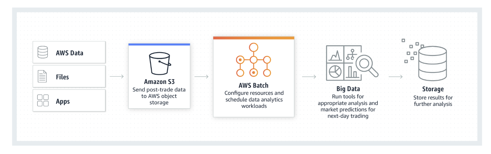

**EC2**

Amazon Elastic Compute Cloud (Amazon EC2) is a web service that provides secure, resizable compute capacity in the cloud. It is designed to make web-scale computing easier for developers.

***

**Instance Types**

* On-Demand Instances—With On-Demand instances, you pay for compute capacity by the hour with no long-term commitments. You can increase or decrease your compute capacity depending on the demands of your application and only pay the specified hourly rate for the instances you use.

* Reserved Instances—Reserved Instances provide you with a significant discount (up to 75%) compared to On-Demand instance pricing. You have the flexibility to change families, operating system types, and tenancies while benefitting from Reserved Instance pricing when you use Convertible Reserved Instances.

* Spot Instances—Spot Instances allow you to bid on spare Amazon EC2 computing capacity. Since Spot instances are often available at a discount compared to On-Demand pricing, you can significantly reduce the cost of running your applications, grow your application’s compute capacity and throughput for the same budget, and enable new types of cloud computing applications.

**Amazon Lightsail**

Amazon Lightsail is designed to be the easiest way to launch and manage a virtual private server with AWS. Lightsail plans include everything you need to jumpstart your project – a virtual machine, SSD-based storage, data transfer, DNS management, and a static IP address – for a low, predictable price.

In lightsail a virtual machine, SSD-based storage, data transfer, DNS management, and a static IP are all offered as a package. Whereas in normal case you provision an EC2 instance and then setup the rest of these things.Also Bandwidth included in the price, no security groups to set up, no need to worry about EBS volumes sizing.

***

**Amazon EC2 Auto Scaling**

Amazon EC2 Auto Scaling helps you maintain application availability and allows you to automatically add or remove EC2 instances according to conditions you define. 

**Amazon Elastic Container Registry**

Amazon Elastic Container Registry (ECR) is a fully-managed Docker container registry that makes it easy for developers to store, manage, and deploy Docker ***container images***. Amazon ECR is integrated with Amazon Elastic Container Service (Amazon ECS), simplifying your development to production workflow. 

**Amazon Elastic Container Service**

Amazon Elastic Container Service (Amazon ECS) is a highly scalable, high-performance container orchestration service that supports Docker containers and allows you to easily run and scale containerized applications on AWS. 

**AWS Fargate**

AWS Fargate is a compute engine for Amazon ECS that allows you to run containers without having to manage servers or clusters. With AWS Fargate, you no longer have to provision, configure, and scale clusters of virtual machines to run containers. This removes the need to choose server types, decide when to scale your clusters, or optimize cluster packing. AWS Fargate removes the need for you to interact with or think about servers or clusters. Fargate lets you focus on designing and building your applications instead of managing the infrastructure that runs them.

Amazon ECS has two modes: Fargate launch type and EC2 launch type. With Fargate launch type, all you have to do is package your application in containers, specify the CPU and memory requirements, define networking and IAM policies, and launch the application. EC2 launch type allows you to have server-level, more granular control over the infrastructure that runs your container applications.

**Amazon Elastic Container**

Service for Kubernetes
Amazon Elastic Container Service for Kubernetes (Amazon EKS) makes it easy to deploy, manage, and scale containerized applications using Kubernetes on AWS.

**AWS Batch**

AWS Batch enables developers, scientists, and engineers to easily and efficiently run hundreds of thousands of batch computing jobs on AWS. AWS Batch dynamically provisions the optimal quantity and type of compute resources (e.g., CPU or memory-optimized instances) based on the volume and specific resource requirements of the batch jobs submitted. With AWS Batch, there is no need to install and manage batch computing software or server clusters that you use to run your jobs, allowing you to focus on analyzing results and solving problems. AWS Batch plans, schedules, and executes your batch computing workloads across the full range of AWS compute services and features, such as Amazon EC2 and Spot Instances.

**AWS Elastic Beanstalk**

AWS Elastic Beanstalk is an easy-to-use service for deploying and scaling web applications and services developed with Java, .NET, PHP, Node.js, Python, Ruby, Go, and Docker on familiar servers such as Apache, Nginx, Passenger, and Internet Information Services (IIS).

You can simply upload your code, and AWS Elastic Beanstalk automatically handles the deployment, from capacity provisioning, load balancing, and auto scaling to application health monitoring. At the same time, you retain full control over the AWS resources powering your application and can access the underlying resources at any time.

*AWS Lambda*

AWS Lambda lets you run code without provisioning or managing servers. You pay only for the compute time you consume—there is no charge when your code is not running. With Lambda, you can run code for virtually any type of application or backend service—all with zero administration. Just upload your code, and Lambda takes care of everything required to run and scale your code with high availability. You can set up your code to automatically trigger from other AWS services, or you can call it directly from any web or mobile app.

**AWS Serverless Application Repository**

The AWS Serverless Application Repository enables you to quickly deploy code samples, components, and complete applications for common use cases such as web and mobile back-ends, event and data processing, logging, monitoring, IoT, and more. Each application is packaged with an AWS Serverless Application Model (SAM) template that defines the AWS resources used. Publicly shared applications also include a link to the application’s source code. There is no additional charge to use the Serverless Application Repository - you only pay for the AWS resources used in the applications you deploy.

You can also use the Serverless Application Repository to publish your own applications and share them within your team, across your organization, or with the community at large. To share an application you've built, publish it to the AWS Serverless Application Repository.

**AWS Outposts**

AWS Outposts bring native AWS services, infrastructure, and operating models to virtually any data center, co-location space, or on-premises facility. You can use the same APIs, the same tools, the same hardware, and the same functionality across on-premises and the cloud to deliver a truly consistent hybrid experience. Outposts can be used to support workloads that need to remain on-premises due to low latency or local data processing needs.

