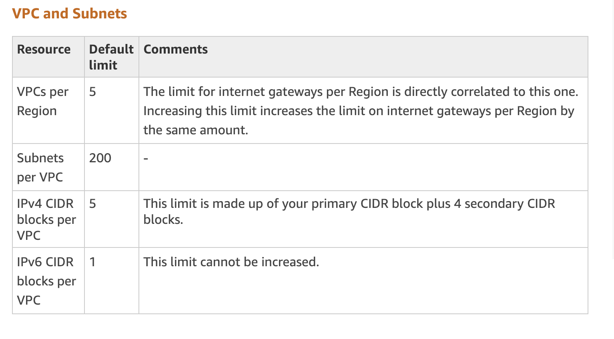
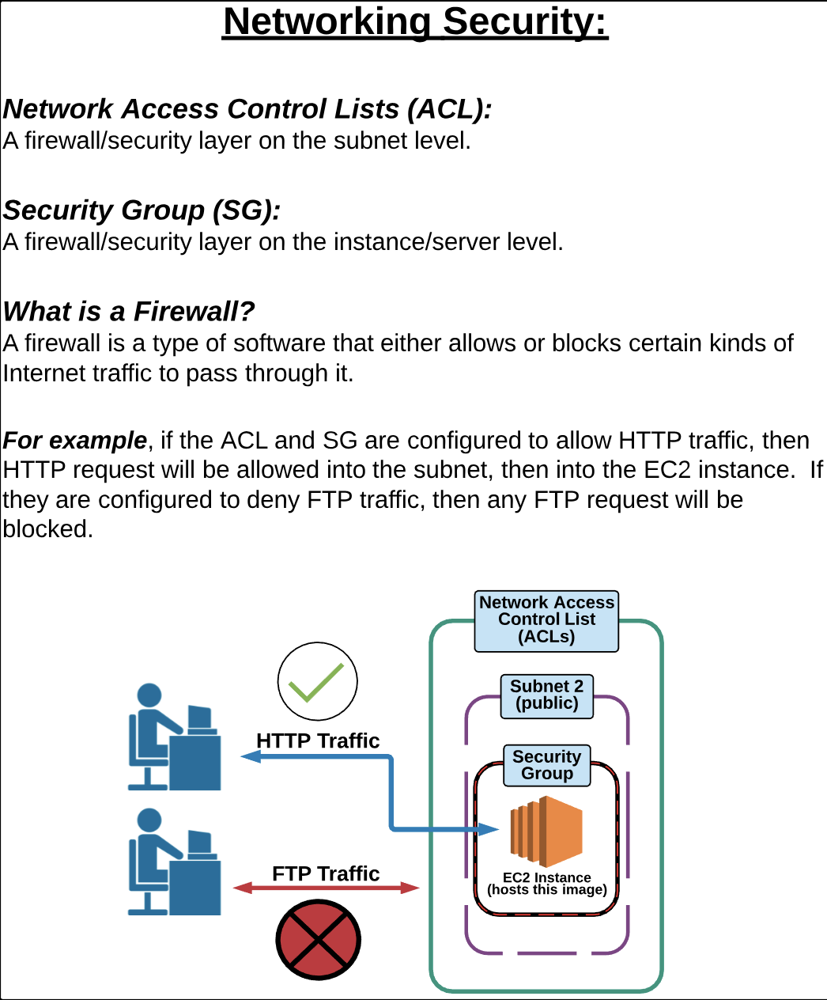

**NETWORKING**

***

**Amazon VPC**
Amazon Virtual Private Cloud (Amazon VPC) lets you provision a logically isolated section of the AWS Cloud where you can launch AWS resources in a virtual network that you define. You have complete control over your virtual networking environment, including selection of your own IP address range, creation of subnets, and configuration of route tables and network gateways. You can use both IPv4 and IPv6 in your VPC for secure and easy access to resources and applications.

Additionally, you can create a hardware virtual private network (VPN) connection between your corporate data center and your VPC and leverage the AWS Cloud as an extension of your corporate data center.

**CIDR** 

When you create a VPC, you must specify a range of IPv4 addresses for the VPC in the form of a Classless Inter-Domain Routing (CIDR) block; for example, 10.0.0.0/16. This is the primary CIDR block for your VPC. 

**Internet Gateways**

An internet gateway is a horizontally scaled, redundant, and highly available VPC component that allows communication between instances in your VPC and the internet.

***
**Networking Security**

**ACL**

Your VPC automatically comes with a modifiable default network ACL. By default, it allows all inbound and outbound IPv4 traffic and, if applicable, IPv6 traffic.

**Security Group**

A security group acts as a virtual firewall for your instance to control inbound and outbound traffic. When you launch an instance in a VPC, you can assign up to five security groups to the instance. 

